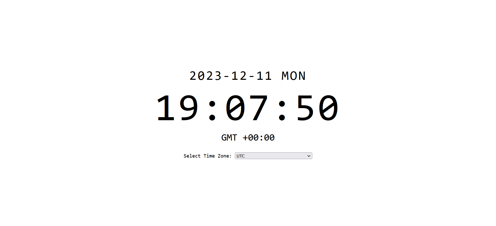

# TerraTick
TerraTick is your cloud-based personal clock. It's designed for simplicity and flexibility.


<!-- table of contents -->
 
# Features
- A shareable standard clock 
- Serverless Infrastructure
- Auto Scaling
- Monitoring and Logging
# Demo

# Tech Stack
- Flask: API framework.
- Zappa: serverless framework for Flask app.
- Docker: to build application artifacts.
- Terraform: infrastructure as code (IAC).
- AWS Lambda: Serverless compute service.
- AWS API Gateway: To manage our APIs.
- Grafana Dashboard: Monitor serverless Flask app.
# Roadmap
- Custom Time Calculation apis  with Different Time Zones
- API Swagger Docs
- Infrastructure Monitoring Solution and Alert System

# Getting Started
## Prerequisites

- AWS credentials with Lambda, S3, CloudWatch, and API Gateway access.
- Docker to build the Zappa artifact.
- Terraform
## Setup
Clone the TerraTick repository:
```shell
git clone https://github.com/PiyushRaj927/TerraTick
```
## Build
TerraTick tick uses [zappa]() to package the flask application to be lamda compatible, to build the zip file run :
```shell
docker compose up build_artifact
```
This creates a `dev.zip` file in the `/app` directory.

# Terraform
Launch Terraform to deploy the app:
```shell
terraform init
terraform apply
```


Visit the `app_url` provided by Terraform in your web browser

to destroy the infrastructure
```shell
terraform destroy
```` 

# Contributions
Feel free to open issues with your suggestions or ideas.

### Note:  TerraTick was built for learning AWS Lambda. I plan to add new features as per the roadmap to further explore DevOps and SRE practices. The exact product? ¯\\_(ツ)_/¯ Well, I figuring that out as I go! 


